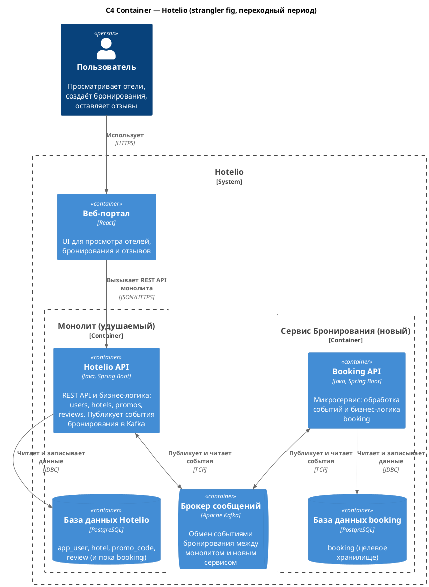

```puml
@startuml
!include <C4/C4_Container>

!$ELEMENT_FONT_SIZE = 10
!$ELEMENT_FONT_COLOR = "#000000"
!$TECH_FONT_SIZE = 8
!$TECH_FONT_COLOR = "#666666"
!$DESCR_FONT_SIZE = 9

!$PERSON_ICON_SIZE = 32
!$SYSTEM_ICON_SIZE = 32
!$EXTERNAL_SYSTEM_ICON_SIZE = 32
!$ICON_SIZE = 32

@startuml
!include <C4/C4_Container>

!$ELEMENT_FONT_SIZE = 10
!$ELEMENT_FONT_COLOR = "#000000"
!$TECH_FONT_SIZE = 8
!$TECH_FONT_COLOR = "#666666"
!$DESCR_FONT_SIZE = 9

title C4 Container — Hotelio (strangler fig, переходный период)

Person(user, "Пользователь", "Просматривает отели, создаёт бронирования, оставляет отзывы")

System_Boundary(hotelio, "Hotelio") {

    Container(web, "Веб-портал", "React", "UI для просмотра отелей, бронирования и отзывов")

    Container_Boundary(monolith, "Монолит (удушаемый)") {
        Container(api, "Hotelio API", "Java, Spring Boot", "REST API и бизнес-логика: users, hotels, promos, reviews. Публикует события бронирования в Kafka")
        ContainerDb(db, "База данных Hotelio", "PostgreSQL", "app_user, hotel, promo_code, review (и пока booking)")
    }

    Container_Boundary(booking, "Сервис Бронирования (новый)") {
        Container(bookingApi, "Booking API", "Java, Spring Boot", "Микросервис: обработка событий и бизнес-логика booking")
        ContainerDb(bookingDB, "База данных booking", "PostgreSQL", "booking (целевое хранилище)")
    }

    ContainerQueue(kafka, "Брокер сообщений", "Apache Kafka", "Обмен событиями бронирования между монолитом и новым сервисом")
}

Rel(user, web, "Использует", "HTTPS")
Rel(web, api, "Вызывает REST API монолита", "JSON/HTTPS")
Rel(api, db, "Читает и записывает данные", "JDBC")
Rel(bookingApi, bookingDB, "Читает и записывает данные", "JDBC")
BiRel(api, kafka, "Публикует и читает события", "TCP")
BiRel(bookingApi, kafka, "Публикует и читает события", "TCP")

@enduml
```